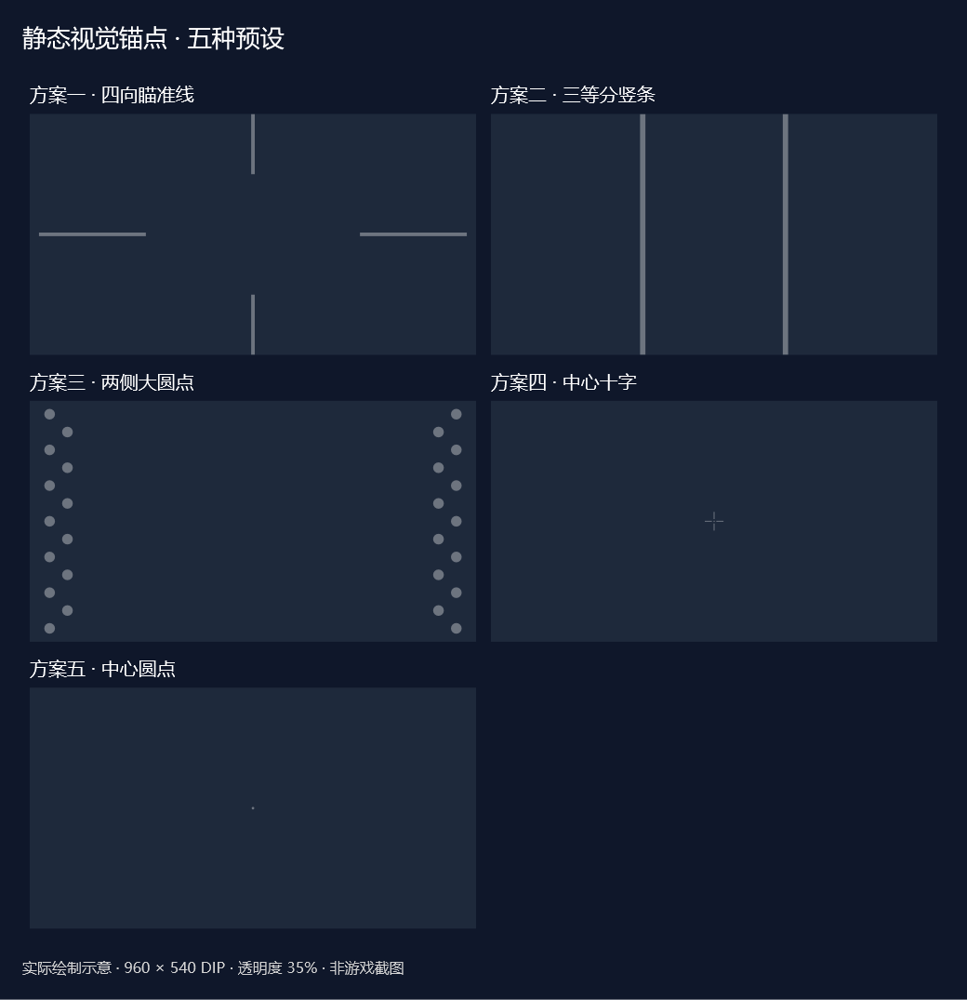

# StaticAnchorOverlay · 给移动的视野一个固定的参考点

**一款为 3D 游戏场景打造的 Windows 静态视觉锚点工具。** 在屏幕上放置固定的十字、边框或自定义图案，让你按自己的习惯调整视觉参照。

画面在动，锚点留在原地。适合希望在探索、驾驶或第一人称视角中保留屏幕参照的玩家。

## 为什么试试它

- **自由搭配十二种元素**：十字、中心点、横线、竖线、边框、四角标记、网格、暗角、本地 PNG、四向瞄准线、三等分竖条和两侧圆点。
- **调成你喜欢的样子**：颜色、透明度、尺寸和位置可按元素调整，合法设置即时应用并自动保存。
- **为不同游戏保存预设**：新建、复制、重命名，通过托盘切换；支持整套 JSON 配置导入和导出。
- **操作不被遮挡**：叠加窗口点击穿透、不抢焦点，支持快捷键随时显示或隐藏。
- **多屏也能用**：选择目标显示器，适配 DPI 缩放；显示器断开时回退主屏，重新连接后恢复。
- **双击即可启动**：Windows x64 便携发布版包含 .NET 运行时，可选当前用户登录后自动启动。
- **本地运行，源码开放**：无第三方 NuGet 依赖；不联网、不截屏、不注入、不读写游戏内存、不修改游戏文件。

## 三步开始

1. 若已有打包文件，解压 `StaticAnchorOverlay-windows-x64.zip`，双击其中的 `StaticAnchorOverlay.exe`。在本地项目已发布的情况下，也可直接运行 `dist\win-x64\StaticAnchorOverlay.exe`。
2. 在设置窗口选择显示器，调整十字、边框和四角标记的透明度；想要更简洁时，可只保留一个中心点。
3. 将游戏设为**无边框窗口或窗口化全屏**，按 `Alt+Shift+A` 随时切换锚点显示。

便携版适用于 Windows 10/11 x64，无需另外安装 .NET。源码构建方式见下文。

| 默认快捷键 | 操作 |
| --- | --- |
| `Alt+Shift+A` | 显示 / 隐藏叠加 |
| `Alt+Shift+S` | 打开设置 |
| `Alt+Shift+Q` | 退出应用 |

快捷键可在设置中修改。关闭设置窗口会最小化到任务栏，应用继续运行；完全退出请使用快捷键、托盘菜单或“退出应用”。

## 先看效果，再选方案



设置中的“方案示意”提供五种预设，点击“添加并使用此方案”生成独立预设，随后可修改颜色、透明度和尺寸：

| 方案 | 布局 |
| --- | --- |
| 四向瞄准线 | 四条从上下左右边缘朝向中心，每条长为对应屏幕尺寸的 25%，条宽 8 DIP |
| 三等分竖条 | 宽度 1/3 与 2/3 处各一条，高度 100%，条宽 12 DIP |
| 两侧大圆点 | 左右各两列交错排列（错开半个纵向间距），直径 24 DIP，纵向间距 80 DIP，列间距 40 DIP |
| 中心十字 | 可调整四臂长度、线宽、间隙和中心圆点 |
| 中心圆点 | 默认直径 6 DIP，提供简洁的中心参照 |

默认透明度为 35%。图为布局示意，不是游戏截图。比例长度随屏幕变化，线宽和圆点尺寸使用 DIP。
自定义准心：在“锚点 → 中心自定义准心 PNG”选择本地透明 PNG，选择后自动启用；调整宽高，X/Y 设为 0 即居中。可关闭十字和中心点避免重叠。

设计意图是让移动画面中保留屏幕固定参照。眩晕可能涉及视觉与前庭等运动信号的冲突；[NHS 对晕动症的说明](https://www.nhs.uk/conditions/motion-sickness/)介绍了此类信号差异。这并不能证明屏幕锚点具有缓解作用，也不能把 3D 或 2D 游戏中的眩晕统一解释为“鼠标与背景绑定不匹配”。

## 按你的习惯配置

想要简单的屏幕参照，可从低透明度的中心点或十字开始；想保留边缘参照，可开启边框与四角标记。也可以选择自己的本地 PNG，并开启 PNG 元素。

配置保存在 `%AppData%\StaticAnchorOverlay\config.json`。导出的预设不会包含 PNG 文件，换电脑时需重新选择图片。开机自启独立于预设，建议先将 EXE 放在固定位置，再在“应用与启动”中开启。

完整参数说明、显示模式限制和手动验收步骤见 [详细使用说明](StaticAnchorOverlay/README.md)。

## 从源码运行

开发环境：Windows、.NET 8 SDK、PowerShell。

```powershell
dotnet build .\StaticAnchorOverlay\StaticAnchorOverlay.csproj -c Release --ignore-failed-sources
dotnet run --project .\StaticAnchorOverlay\StaticAnchorOverlay.csproj -c Release --no-build
```

发布包含运行时的 Windows x64 单文件版本：

```powershell
dotnet publish .\StaticAnchorOverlay\StaticAnchorOverlay.csproj -p:PublishProfile=WindowsPortable -o .\dist\win-x64 --ignore-failed-sources
```

构建环境可能需要下载对应运行时包。生成便携 ZIP、源码 ZIP 与完整源码文档：

```powershell
.\Package.ps1
```

验证配置和预设逻辑（输出到临时目录，避免改写仓库示例）：

```powershell
dotnet run --project .\Verification\Verification.csproj -- "$env:TEMP\StaticAnchorOverlay-verification.json"
```

## 使用边界

本应用提供静态视觉参照，不承诺缓解晕 3D 或治疗效果。独占全屏下叠加可能无法显示；游戏中的显示、点击穿透和性能需在实际环境中验证。请遵守游戏及反作弊规则，外部叠加的兼容性不作保证。

渲染没有每帧定时器或动画，仅在配置、布局或显示环境变化时重绘；透明窗口仍需系统合成，实际资源占用取决于设备与设置。

## 开源与分享

采用 [MIT 许可证](LICENSE)。欢迎提出问题、贡献改进，或把它分享给想为 3D 游戏增加固定视觉参照的朋友。

> StaticAnchorOverlay：让视野里的参照点，由你决定。
